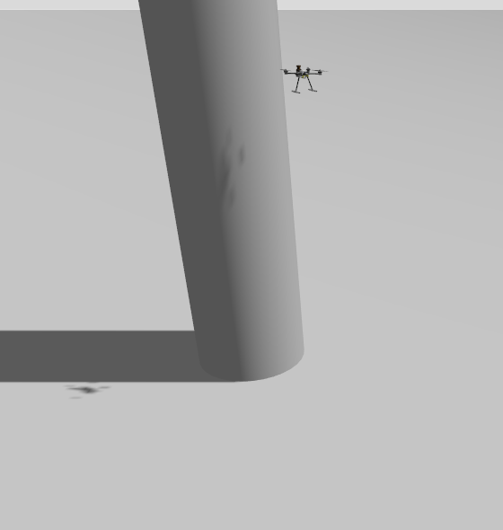
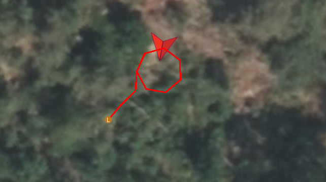

# 🛩️ UAV LiDAR-Based Circular Trajectory Control

This project implements a **LiDAR-guided UAV navigation system** using ROS 2 and PX4, integrating:
1. A **position PID controller** that generates velocity setpoints.
2. A **LiDAR-based object detection** module to localize a target (e.g., a column).
3. A **circular trajectory planner** that makes the drone orbit around the detected object.

---

## 📸 Project Overview

*(Add your images here)*

- **Drone in Gazebo near the column:**  
  

- **QGroundControl visualization of the circular path:**  
  

---

## 🧭 System Architecture

The project follows a modular design, with three main components:

### 1. Position PID Controller
The **PID controller** regulates the drone’s position by computing velocity setpoints along the X, Y, and Z axes.  
It uses feedback from PX4’s `/vehicle_local_position` topic and aims to minimize position errors.

**Workflow:**
- Compute error between reference position and actual drone position.
- Apply the PID law:  
  \[
  u(t) = K_p e(t) + K_i \int e(t) dt + K_d \frac{de(t)}{dt}
  \]
- Generate **velocity setpoints** and publish them to PX4 (`/fmu/in/trajectory_setpoint`).

🧩 *Status:*  
This controller is developed and tested independently — not yet integrated into the LiDAR-based navigation node.

---

### 2. LiDAR Integration and Object Detection
The drone is equipped with a 2D LiDAR sensor that continuously scans the environment.

**Main steps:**
1. Subscribes to the `/scan` topic (type `sensor_msgs/LaserScan`).
2. Processes the range data to find the **closest object** (the column).
3. Converts the object’s position from **LiDAR frame** to **global NED coordinates** using drone attitude (yaw).

Once the **LiDAR** detects and stabilizes the position of the object (the column), the **center** of the circular trajectory is defined as the **global coordinates** of that detected object.

---

### 3. Circular Trajectory Planning Around the Object
After detecting the object, the drone transitions to a **CIRCULAR_PATH** phase.

**Algorithm**:

1. Compute the current azimuthal angle around the object (phi).
2. Increment it over time to create a smooth orbit.
3. Generate a circular trajectory centered at the object and ithe drone gets too close to the center, a radial safety condition pushes it outward to avoid cutting through the column.
